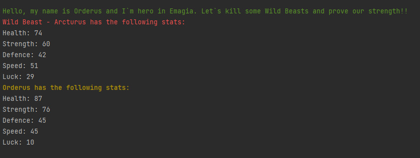

# TheHeroGame by eMAG
 
 
The first screenshot shows the random values with which Orderus is initialized, but also the values of its opponent.
 

The second screenshot shows the fight between Orderus and his opponent.

To run this game, you need to go into runningGame folder and run testingGame.php 
# (TheHeroGame/runningGame/testingGame.php)
